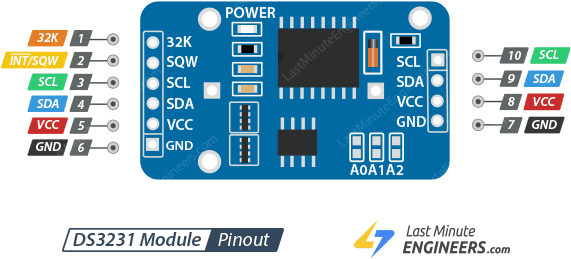
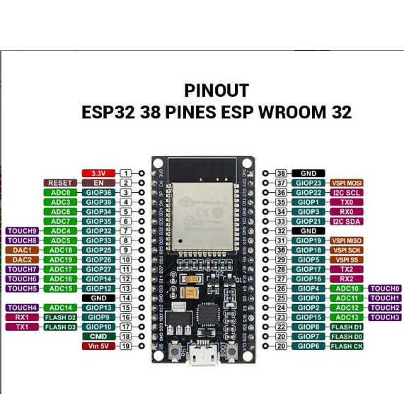

# TheODOR Advanced

TheODOR misst Luftfeuchtigkeit, Temperatur, Druck, Luftqualität (eCO2 Werte) und Feinstaubwerte und veröffentlich dann die Werte über eine MQTT-Verbindung auf der [OpenSenseMap](https://opensensemap.org/).

## Hardware

- ESP32
- Sensor BME280 (Temperatur, Luftfeuchtigkeit und Druck)
- Sensor CCS811 (eCO2)
- Sensor PMS3003 (Feinstaub: PM1.0, PM2.5, PM10)
- externe Stromquelle von 5V für PMS3003
- Jumper-Kabel

## Pinbelegung

| PMS3003 | ESP32 Pin | Funktion                       | Beschreibung        |
| :------ | :-------- | :----------------------------- | :------------------ |
| VCC     | -         | Stromversorgung                | externe Stromquelle |
| GND     | GND       | Masse                          |                     |
| SET     | GPIO4     | Arbeits- oder Schlafmodusmodus |                     |
| RX      | GPIO19    | UART-RX                        | Empfang ! 3.3V      |
| TX      | GPIO18    | UART-TX                        | Senden ! 3.3V       |

Der Feinstaub-Sensor arbeitet optisch mit einem Laser und einem kleinen Lüfter. Achte darauf, dass die Ansaugöffnung der Wetterstation vor Insekten geschützt ist (z.B. durch ein feines Netz), aber dennoch frei atmen kann.

| CSS811 | ESP32 Pin | Funktion        | Beschreibung                                      |
| :----- | :-------- | :-------------- | :------------------------------------------------ |
| VCC    | 3.3V      | Stromversorgung |
| GND    | GND       | Masse           |
| SCL    | GPIO22    | I2C SCL         | Datenleitung                                      |
| SDA    | GPIO21    | I2C SDA         | Datenleitung                                      |
| WAK    | GND       | WAKE-PIN        | muss auf Masse liegen, damit der Sensor aktiv ist |

Der CSS811 muss beim Erstbetrieb 48 Stunden lang im Dauerbetrieb laufen, damit sich die Chemikalien lösen und richtige Werte gemessen werden können. Danach braucht der Sensor bei jedem Start ca. 20 Minuten um echte Schwankungen zu messen.

| BME280 | ESP32 Pin | Funktion        | Beschreibung |
| :----- | :-------- | :-------------- | :----------- |
| VCC    | 3.3V      | Stromversorgung |
| GND    | GND       | Masse           |
| SCL    | GPIO22    | I2C SCL         | Datenleitung |
| SDA    | GPIO21    | I2C SDA         | Datenleitung |

| microSD SPI or SDIO | ESP32 Pin | Funktion        |
| :------------------ | :-------- | :-------------- |
| 3V                  | 3.3V      | Stromversorgung |
| GND                 | GND       | Masse           |
| CLK                 | GPIO14    | SPI SCK / Clock |
| SO                  | GPIO12    | SPI MISO        |
| SI                  | GPIO13    | SPI MOSI        |
| CS                  | GPIO27    | Chip Select     |

| RTC (DS3231) | ESP32 Pin | Funktion        |
| :----------- | :-------- | :-------------- |
| VCC          | 3.3V      | Stromversorgung |
| GND          | GND       | Masse           |
| SCL          | GPIO22    | Datenleitung    |
| SDA          | GPIO21    | Datenleitung    |

Alle Masse Pins (GND) müssen miteinander verbunden sein!

## Bibliotheken

- PubSubClient.h
- ArduinoJson.h
- Wire.h
- WiFi.h
- HardwareSerial.h
- Adafruit_CCS811.h
- Adafruit_BME280.h
- Adafruit BusIO
- RTClib.h
- SPI.h
- SD.h

**Wichtiger Hinweis zur Installation:** Bei der Installation der Adafruit_CCS811 Bibliothek in der Arduino IDE muss zwingend auch die Adafruit BusIO Bibliothek installiert werden. Wähle bei der Abfrage am besten "Install all dependencies" aus.

## Konfigurations-Schritte

Bevor der Code auf den ESP32 geladen wird, müssen folgende Variablen im Sketch angepasst werden:

### Über MQTT-Verbindung:

1. **WLAN-Daten:** ssid und password deines lokalen Netzwerks.
2. **Station-Name:** Vergib einen eindeutigen Namen für station_name (z.B. station_ort_01). Dieser Name muss einmalig sein!
3. **Sensor-IDs:** Erstelle eine neue Station auf [openSenseMap.org](https://opensensemap.org/) und kopiere die IDs für Temperatur, Feinstaub etc. in die entsprechenden ID\_-Variablen im Code.
4. **MQTT-Topic:** Achte darauf, dass im mqtt_topic keine Leerzeichen und Umlaute enthalten sind. Das Topic im Code muss exakt mit dem in der OpenSenseMap hinterlegten Topic übereinstimmen.
   Formuliere es am besten in diesem Format: "BEZIRK/ORT/STATION1/DATA" (z.B. "schaerding/zellPram/station1/data).

### Datenspeicherung auf SD-Karte:

**Zeitzone:** die RTC muss in der richtigen Zeitzone (UTC) laufen, sonst nimmt die OpenSenseMap die Daten nicht an. Wenn die RTC in der MEZ (Mittereuropäischer Normalzeit) läuft, dann uploade den Hilfs-Sketch und die RTC wird auf UTC umgestellt.

## Troubleshooting

- **Keine Daten in der OSEM?** Prüfe im Seriellen Monitor, ob "Erfolgreich gesendet" erscheint. Wenn ja, kontrolliere, ob der Flespi-Token und das Topic in OSEM korrekt hinterlegt sind.
- **Kompilierfehler?** Sicherstellen, dass alle Bibliotheken (insbes. Adafruit BusIO) aktuell sind.
- **zu großer Payload?** Wenn die Daten zu groß sind und nicht verschickt werden können, dann setze die Buffersize größer (_client.setBufferSize(512);_)
