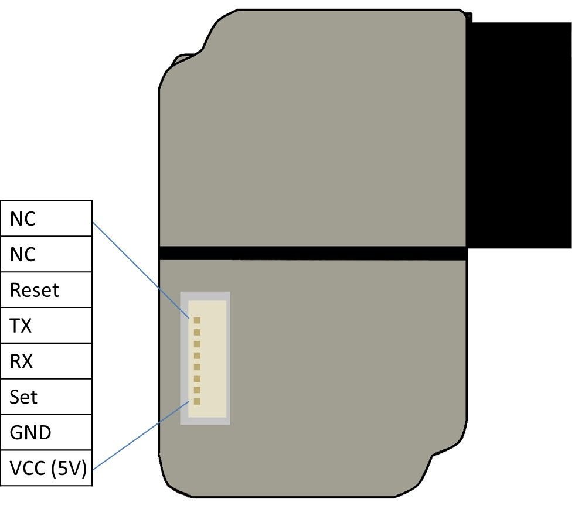

# TheODOR Advanced

TheODOR misst nicht nur Luftfeuchtigkeit, Temperatur und Druck, sondern auch einen eCO2 Wert (Luftqualität) und Feinstaubwerte.

## Hardware

- ESP32
- Sensor BME280 (Temperatur, Luftfeuchtigkeit und Druck)
- Sensor CCS811 (eCO2)
- Sensor PMS3003 (Feinstaub: PM1.0, PM2.5, PM10)
- externe Stromquelle von 5V für PMS3003
- Jumper-Kabel

## Pinbelegung

| PMS3003 | ESP32 Pin | Funktion                       | Beschreibung        |
| :------ | :-------- | :----------------------------- | :------------------ |
| VCC     | -         | Stromversorgung                | externe Stromquelle |
| GND     | GND       | Masse                          |                     |
| SET     | GPIO4     | Arbeits- oder Schlafmodusmodus |                     |
| RX      | GPIO19    | UART-RX                        | Empfang ! 3.3V      |
| TX      | GPIO18    | UART-TX                        | Senden ! 3.3V       |

| CSS811 | ESP32 Pin | Funktion        | Beschreibung                                      |
| :----- | :-------- | :-------------- | :------------------------------------------------ |
| VCC    | 3.3V      | Stromversorgung |
| GND    | GND       | Masse           |
| SCL    | GPIO22    | I2C SCL         | Datenleitung                                      |
| SDA    | GPIO21    | I2C SDA         | Datenleitung                                      |
| WAK    | GND       | WAKE-PIN        | muss auf Masse liegen, damit der Sensor aktiv ist |

Der CSS811 muss beim Erstbetrieb 48 Stunden lang im Dauerbetrieb laufen, damit sich die Chemikalien lösen und richtige Werte gemessen werden können. Danach braucht der Sensor bei jedem Start ca. 20 Minuten um echte Schwankungen zu messen.

| BME280 | ESP32 Pin | Funktion        | Beschreibung |
| :----- | :-------- | :-------------- | :----------- |
| VCC    | 3.3V      | Stromversorgung |
| GND    | GND       | Masse           |
| SCL    | GPIO22    | I2C SCL         | Datenleitung |
| SDA    | GPIO21    | I2C SDA         | Datenleitung |

## Bibliotheken

- Wire.h
- Adafruit_CCS811.h
- HardwareSerial.h
